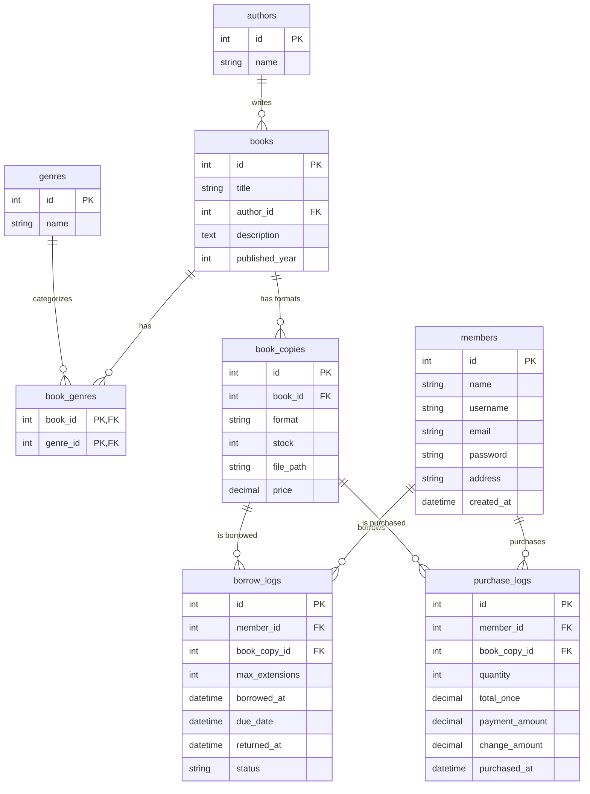

# Library Management System (LiMS) - Technical Documentation

## 1. ER Diagram

The following Mermaid diagram illustrates the Entity-Relationship model for the Library Management System.



---

## 2. Relational Schema

The conceptual ER diagram is mapped to the following 8 relations:

1.  **authors** (**id**, name)
2.  **books** (**id**, title, *author_id*, description, published_year)
    - *author_id* references authors(id)
3.  **genres** (**id**, name)
4.  **book_genres** (***book_id***, ***genre_id***)
    - *book_id* references books(id)
    - *genre_id* references genres(id)
5.  **book_copies** (**id**, *book_id*, format, stock, file_path, price)
    - *book_id* references books(id)
6.  **members** (**id**, name, username, email, password, address, created_at)
7.  **borrow_logs** (**id**, *member_id*, *book_copy_id*, max_extensions, borrowed_at, due_date, returned_at, status)
    - *member_id* references members(id)
    - *book_copy_id* references book_copies(id)
8.  **purchase_logs** (**id**, *member_id*, *book_copy_id*, quantity, total_price, payment_amount, change_amount, purchased_at)
    - *member_id* references members(id)
    - *book_copy_id* references book_copies(id)

---

## 3. Query Scenarios & Mappings

### Scenario 1: List all available genres.
*Requirement: Basic Selection/Projection.*

- **SQL:**
  ```sql
  SELECT name FROM genres ORDER BY name ASC;
  ```
- **Stepwise Relational Algebra:**
  1. $R_1 \leftarrow \text{genres}$
  2. $Result \leftarrow \pi_{name}(R_1)$
- **Compact Relational Algebra:**
  $$\pi_{name}(\text{genres})$$

---

### Scenario 2: Find books with "Classic" as one of its genres.
*Requirement: Join and Filter.*

- **SQL:**
  ```sql
  SELECT b.title
  FROM books b
  JOIN book_genres bg ON b.id = bg.book_id
  JOIN genres g ON bg.genre_id = g.id
  WHERE g.name = 'Classic';
  ```
- **Stepwise Relational Algebra:**
  1. $G \leftarrow \sigma_{name = 'Classic'}(\text{genres})$
  2. $BG \leftarrow G \bowtie_{id = genre\_id} \text{book\_genres}$
  3. $B \leftarrow BG \bowtie_{book\_id = id} \text{books}$
  4. $Result \leftarrow \pi_{title}(B)$
- **Compact Relational Algebra:**
  $$\pi_{title}(\sigma_{name = 'Classic'}(\text{genres}) \bowtie \text{book\_genres} \bowtie \text{books})$$

---

### Scenario 3: List all books and their respective authors.
*Requirement: Natural Join.*

- **SQL:**
  ```sql
  SELECT b.title, a.name AS author_name
  FROM books b
  JOIN authors a ON b.author_id = a.id;
  ```
- **Stepwise Relational Algebra:**
  1. $R_1 \leftarrow \text{books} \bowtie_{author\_id = id} \text{authors}$
  2. $Result \leftarrow \pi_{title, name}(R_1)$
- **Compact Relational Algebra:**
  $$\pi_{title, name}(\text{books} \bowtie_{author\_id = id} \text{authors})$$

---

### Scenario 4: Retrieve unified activity history (Borrows & Purchases) for a specific member.
*Requirement: UNION.*

- **SQL:**
  ```sql
  (SELECT 'BORROW' as type, b.title, bl.borrowed_at as date 
   FROM borrow_logs bl 
   JOIN book_copies bc ON bl.book_copy_id = bc.id 
   JOIN books b ON bc.book_id = b.id 
   WHERE bl.member_id = 1)
  UNION
  (SELECT 'PURCHASE' as type, b.title, pl.purchased_at as date 
   FROM purchase_logs pl 
   JOIN book_copies bc ON pl.book_copy_id = bc.id 
   JOIN books b ON bc.book_id = b.id 
   WHERE pl.member_id = 1);
  ```
- **Stepwise Relational Algebra:**
  1. $B_{logs} \leftarrow \sigma_{member\_id=1}(\text{borrow\_logs} \bowtie \text{book\_copies} \bowtie \text{books})$
  2. $B_{hist} \leftarrow \pi_{'BORROW', title, borrowed\_at}(B_{logs})$
  3. $P_{logs} \leftarrow \sigma_{member\_id=1}(\text{purchase\_logs} \bowtie \text{book\_copies} \bowtie \text{books})$
  4. $P_{hist} \leftarrow \pi_{'PURCHASE', title, purchased\_at}(P_{logs})$
  5. $Result \leftarrow B_{hist} \cup P_{hist}$
- **Compact Relational Algebra:**
  $$\pi_{'BORROW', title, borrowed\_at}(\sigma_{member\_id=1}(\text{borrow\_logs} \bowtie \dots)) \cup \pi_{'PURCHASE', title, purchased\_at}(\sigma_{member\_id=1}(\text{purchase\_logs} \bowtie \dots))$$

---

### Scenario 5: Find books that a member has NOT yet borrowed ("New Discoveries").
*Requirement: SET DIFFERENCE.*

- **SQL:**
  ```sql
  SELECT id FROM books
  WHERE id NOT IN (
      SELECT bc.book_id FROM borrow_logs bl
      JOIN book_copies bc ON bl.book_copy_id = bc.id
      WHERE bl.member_id = 1
  );
  ```
- **Stepwise Relational Algebra:**
  1. $AllBooks \leftarrow \pi_{id}(\text{books})$
  2. $BorrowedBooks \leftarrow \pi_{book\_id}(\sigma_{member\_id=1}(\text{borrow\_logs} \bowtie \text{book\_copies}))$
  3. $Result \leftarrow AllBooks - BorrowedBooks$
- **Compact Relational Algebra:**
  $$\pi_{id}(\text{books}) - \pi_{book\_id}(\sigma_{member\_id=1}(\text{borrow\_logs} \bowtie \text{book\_copies}))$$

---

### Scenario 6: Find all authors who have written books in the 'Fantasy' genre.
*Requirement: Multi-table Join and Filtering.*

- **SQL:**
  ```sql
  SELECT DISTINCT a.name
  FROM authors a
  JOIN books b ON a.id = b.author_id
  JOIN book_genres bg ON b.id = bg.book_id
  JOIN genres g ON bg.genre_id = g.id
  WHERE g.name = 'Fantasy';
  ```
- **Stepwise Relational Algebra:**
  1. $G \leftarrow \sigma_{name='Fantasy'}(\text{genres})$
  2. $BG \leftarrow G \bowtie_{id=genre\_id} \text{book\_genres}$
  3. $B \leftarrow BG \bowtie_{book\_id=id} \text{books}$
  4. $A \leftarrow B \bowtie_{author\_id=id} \text{authors}$
  5. $Result \leftarrow \pi_{name}(A)$
- **Compact Relational Algebra:**
  $$\pi_{name}(\sigma_{name='Fantasy'}(\text{genres}) \bowtie \text{book\_genres} \bowtie \text{books} \bowtie \text{authors})$$
